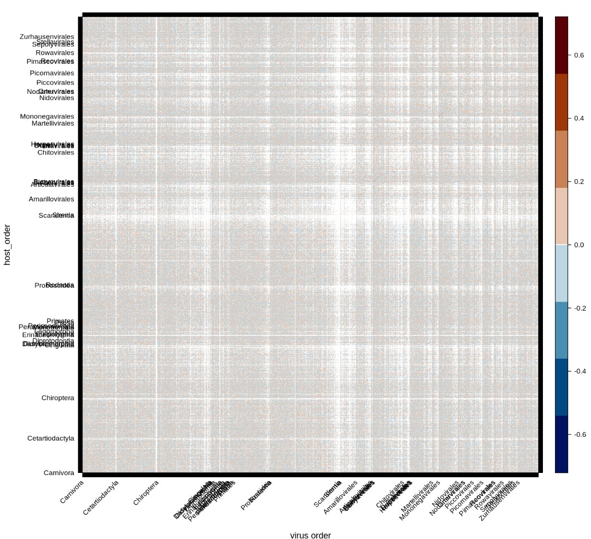
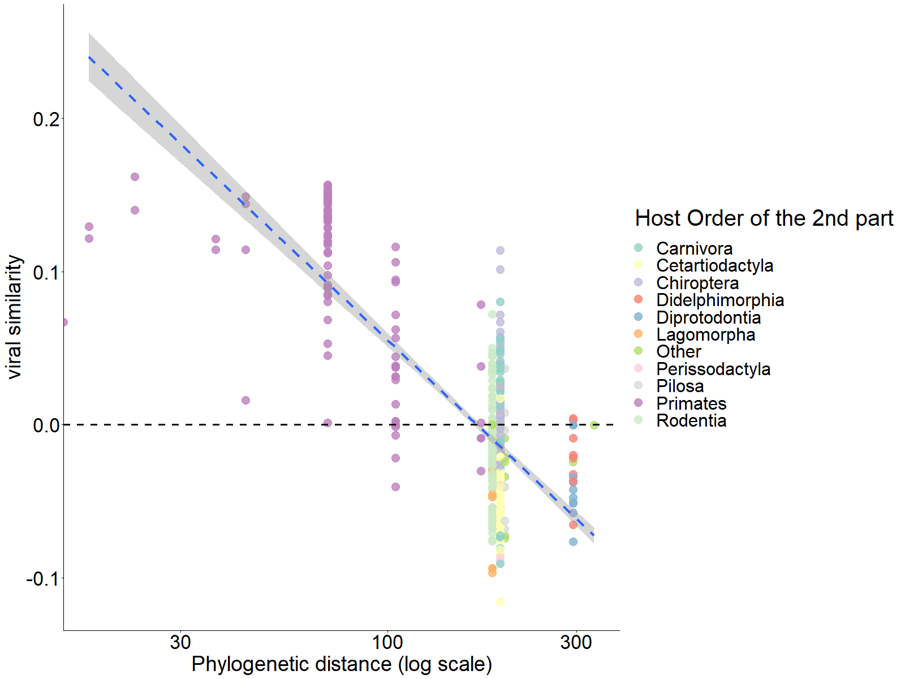
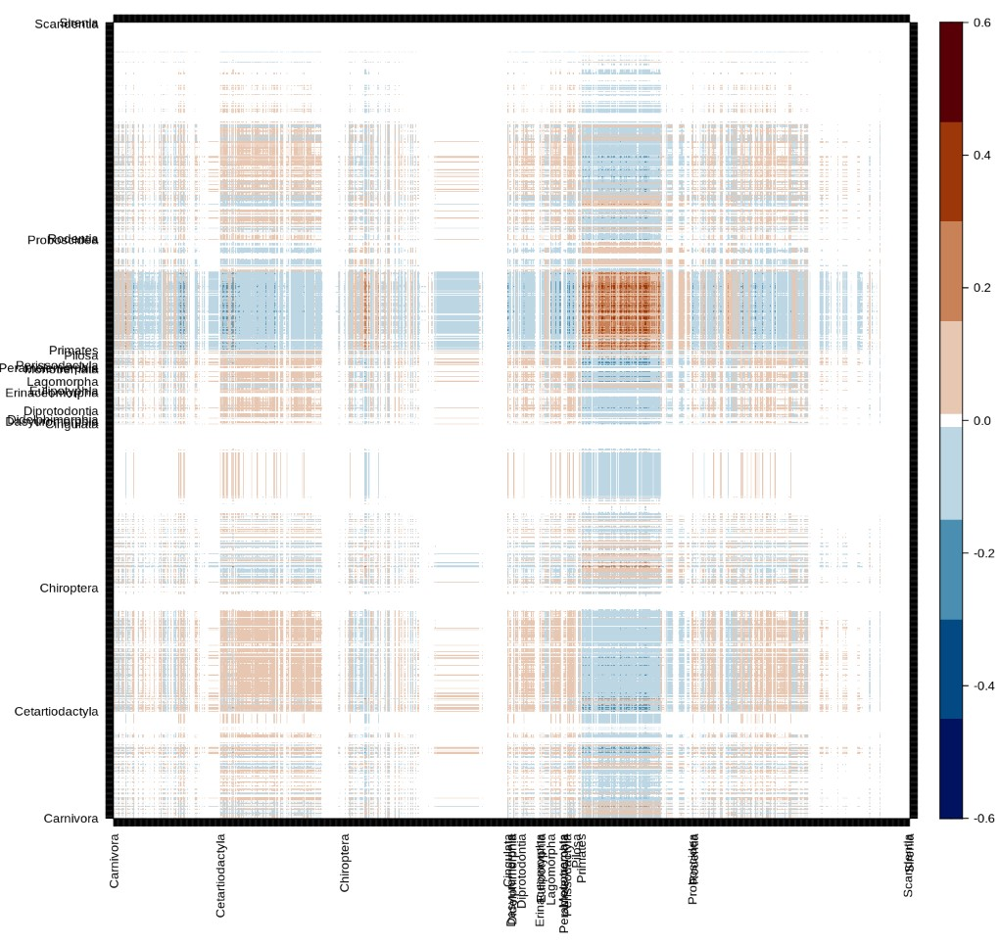
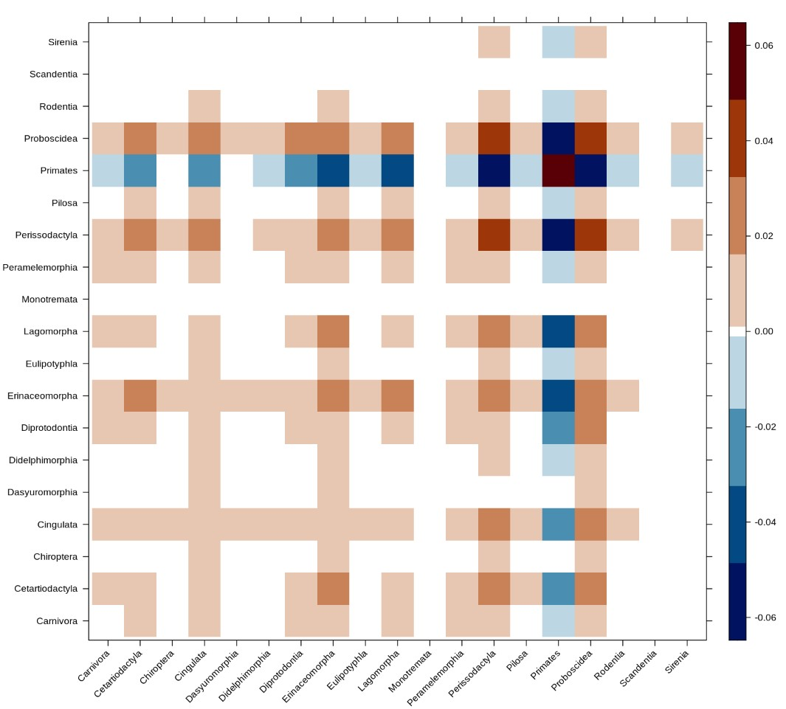
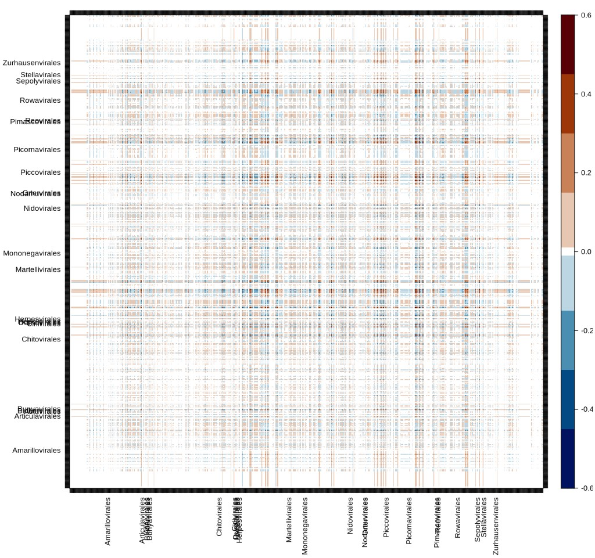
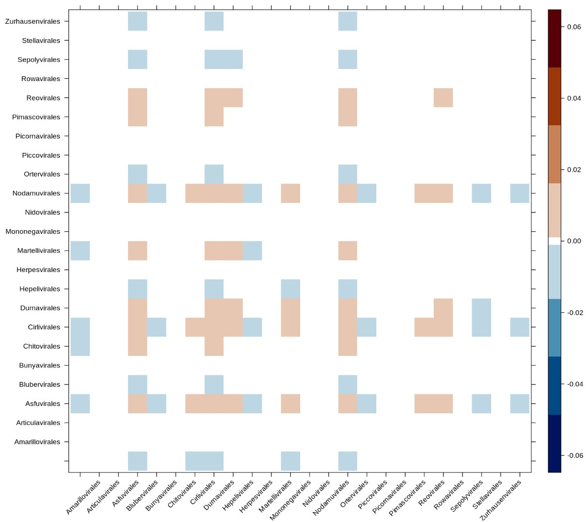
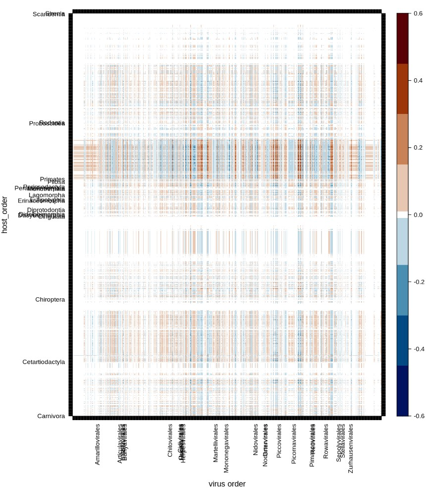
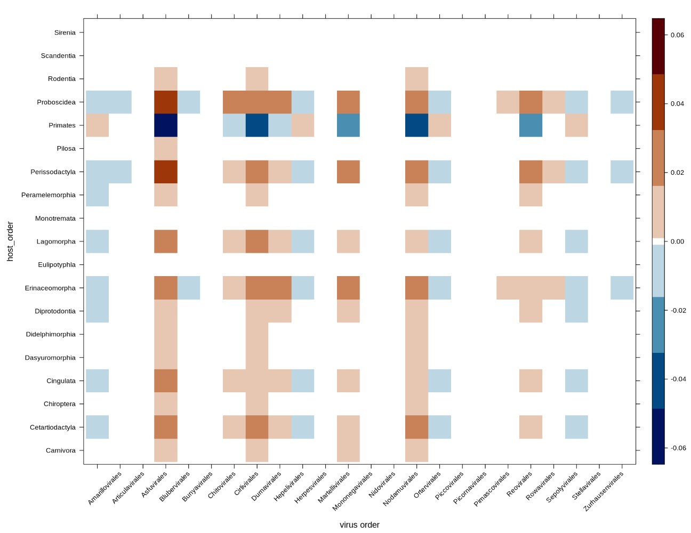
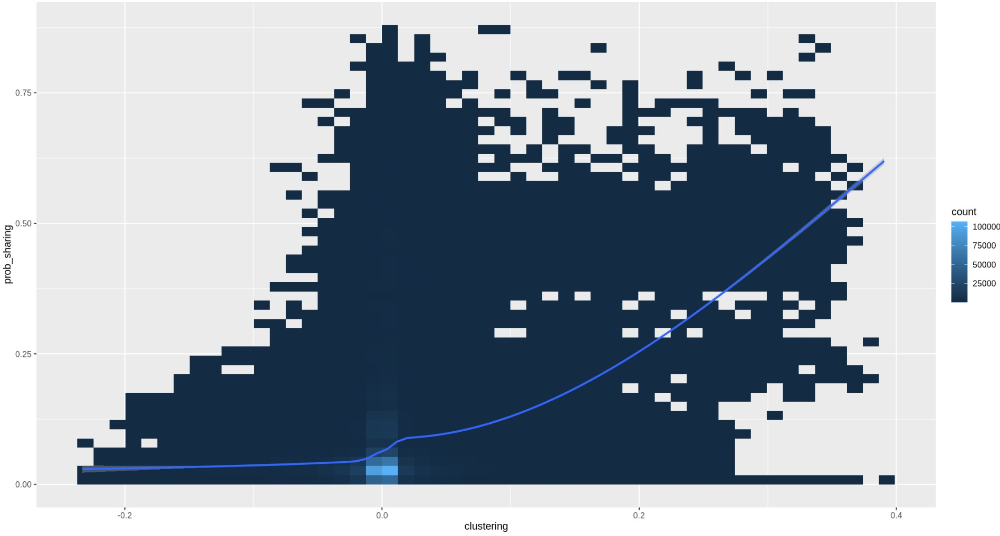
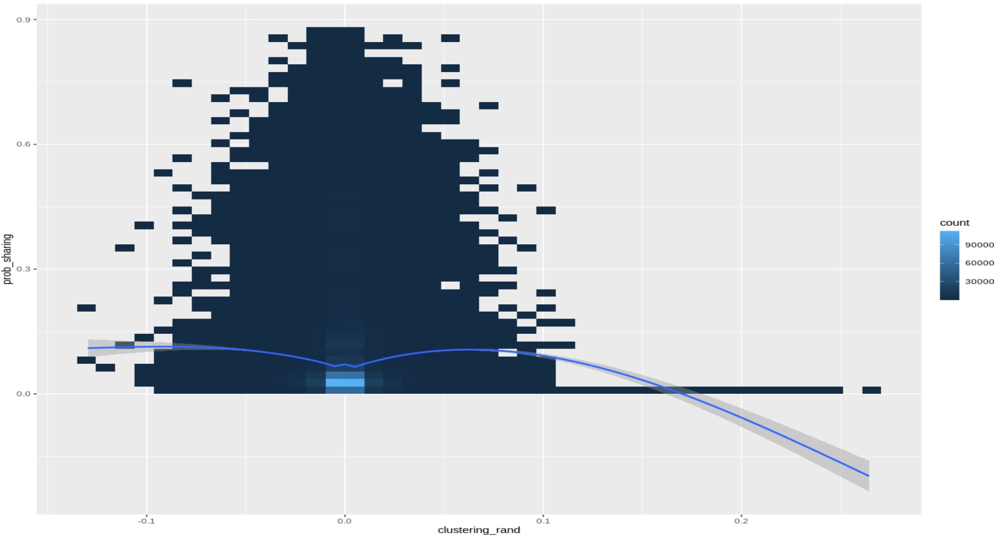

## Introduction

1.  Global health needs more ecology in viral forecasting

    Predicting viral spillover for future pandemic prevention + importance of ecology in the context of global health [@Belay2017Zoonotic; @Carroll2018Global] [@Plowright2017Pathways]. Works have been done to predict viral hotspot according to climate change [@Carlson2022Climate], future host distribution [@Morales-Castilla2021Forecasting] and potential viral sharing among host [@Albery2020Predicting]. Bring informations on potential spillover path. @Albery2020Predicting viral sharing is based on phylogenetic and geographic overlap, they show that phylogenetic similarity is much more decisive on viral sharing than geographical overlapping. Knowing that species migration is at is highest, there is a need to develop models that predict potential viral sharing of species even if they don't overlap. Using phylogenetic seams to be conclusive. We want to bring an other approach that use global structure Metaweb. A metaweb is a network that resume potential interactions... Metawebs contains precious ecological information @Morales-Castilla2015Inferrina

    @Poisot2023Network have develop a link prediction method for host virus metaweb. Showing that unrealised or non discover associations can be infer using a network dimension reduction method. Enable a better prediction of viral infection on human. This imputed metawab has no geographical constrain. A question can arise, can we use the imputed metaweb structure to make prediction of most likely viral spillover ? and top viral sharing species with human (or any other) ? (*I'm not sure what can communicability add to the embedding, because embedding already take into account the global structure of the network. A prediction of link isn't enough ? Plus, the embedding already give a probability of observing an association. I still need to think about it.*)

    We want to propose an approach that take the big picture as input (the network as a hole) and provide information at the lower level (the link). For this we used a matrix function introduce by @Estrada2008Communicability

2.  Communicability is really flexible, as shown in @Benzi2020Matrix it already has application in multiple subject such as neurology, cancer detection, economic... and is used for community detection, spread of information/contagion. This matrix function barely (or not) used on ecological network.

3.  Using communicability we try to extract informations on metaweb with predicted association. We are exploring the community detection method to extract group of host with similar viral sharing, group of virus with similar host sharing.

    By using global structure of a network it is possible with to deduce small scale properties such as viral sharing potential between to species, importance of species or importance of association in the network.

4.  Explaining why we think that communicability is a proxy for viral sharing. Host host part of $A^2$ is known to be direct viral sharing, aka the exact number of virus share between 2 host (same apply for virus-virus, the the number of host share between two). Host host part of $A^4$ is the nubmer of virus share between the 2 host plus the number of virus share with any other intermediary host, etc... . Communicability quantify this but add a penalization each time we add intermediary. This penalization enable to simulate the "difficulty" for a virus to transit from one host to an other if they are "far away" in the network.

5.  Communicability (G) is a quantification closely related to total sharing viral diversity ( \$A\^2\$ ). G will be strong when one or both host have a high viral diversity. It can be simply explain by the fact that a hight diversity mean in general more path to connect both nodes, so the communicability between those is better. The clustering (\$\\Delta G\$, or viral spectrum similarity) is not exactly the same. It will not by highly positive when both have a hight viral diversity or highly negative when both have a low viral diversity. No! it will depend on the similarity of both node, the quantity is not taken in consideration. For example, lets suppose that one part of a pair have a hight viral diversity and the other less, also that the hight viral diverse one have most virus of the second one. G will be srtong between the two host because of the one highly connected. But if we look at the clustering, the highly connected host is considered as a "generalist host", it share virus with a lot of other host. Even if the less connected one does share almost all of is virus with the other the "virus spectrum" of both host is completely different, so the clustering between those two will be weak.

## Methods

Communicability quantify how well information transit between two nodes by considering all possible path in a network and penalizing longer ones. It is compute with the exponent of the adjacency matrix of the network. $$G=\sum_{k=0}^{\infty} \frac{\left(\mathbf{A}^k\right)}{k !}=e^{\mathbf{A}}$$

where $G$ is the communicability matrix, $A$ the adjacency matrix and k is used as a penalizing term. It is possible to compute the exponential of a matrix with the graph spectrum :

$$
G=\sum^n_{j=1}\varphi_j\varphi_j^T e^{\lambda_j}
$$

where $\varphi_j$ and $\lambda_j$ are respectively the $j^{th}$ eigenvectors and eigenvalues of the matrix $A$. Obtain cluster with Communicability is done only by removing the fist dimension in the computation of the previous equation.

$$
\Delta G=\sum^n_{j=1}\varphi_j\varphi_j^T e^{\lambda_j} -\varphi_1\varphi_1^{T} e^{\lambda_1}
$$

In this equation we are removing to global sum the dot production of the first eigenvector(and eigenvalue) to find the clustering matrix $\Delta G$. Let's keep in mind this final result and explain why this work for clustering.

We start with the spectral form of $G$ that can be decompose by the following way :

$$
G=\varphi_1\varphi_1^{T} e^{\lambda_1}+ 
\sum^n_{j=2}\varphi_j^{+}\varphi_j^{+T} e^{\lambda_j}+ 
\sum^n_{j=2}\varphi_j^{-}\varphi_j^{-T} e^{\lambda_j}+
\sum^n_{j=2}\varphi_j^{-}\varphi_j^{+T} e^{\lambda_j}
$${#eq:cluster1}

\

where $\varphi_j^+$ or $\varphi_j^-$ indicate respectively all the positives or negatives values of the $j^{th}$ eigenvector. A way to think about it would be that when $\varphi_j^+$ all negative values are set to 0 and when when $\varphi_j^-$ all positive values are set to 0. @Estrada2008Communicability explain that "two nodes have the same sign in an eigenvector if they can be considered as being in the same partition of the network, while those pairs having different signs correspond to nodes in different partitions.". $$\sum^{intracluster}_{j=2}\varphi_j\varphi_j^{T} e^{\lambda_j} = \sum^n_{j=2}\varphi_j^{+}\varphi_j^{+T} e^{\lambda_j}+ \sum^n_{j=2}\varphi_j^{-}\varphi_j^{-T} e^{\lambda_j}$$

and

$$\sum^{intercluster}_{j=2}\varphi_j\varphi_j^{T} e^{\lambda_j} = \sum^n_{j=2}\varphi_j^{-}\varphi_j^{+T} e^{\lambda_j}$$

so the clustering matrix is obtain with

$$\Delta G = \sum^{intracluster}_{j=2}\varphi_j\varphi_j^{T} e^{\lambda_j} -
\left|\sum^{intercluster}_{j=2}\varphi_j\varphi_j^{T} e^{\lambda_j}\right|$$

The absolute operator is not useful, it is just here to remind that all inter cluster values are negatives. The dot product of $\varphi_j\varphi_j^{T}$ produce a matrix with positive and negative sign depending on the sign of $\varphi_j(p)$ and $\varphi_j(q)$. The first is not include because all the values the eigenvector the same sign, so it is not really informative (In fact it consider the hole network as one cluster thus it does not bring interesting information on the clustering).

In short we can rewrite $\Delta G$ as follow :

$$\Delta G = 
G - \varphi_{1} \varphi_{1}^T e^{\lambda_1}$$

which was the form in which we introduce it.

##### Remark 1

Each dimension of the spectra form the 2nd to the last one is a clustering configuration of the network. Cluster identified by dim 3 are not necessarily independent form those in dim 2 or 4 (or all others). Although the cluster form by dim 2 are "stronger" then 3, 4, 5 ... and so on till the last one. So the dim 2 is the one that contribute the most for $\Delta G$ (we can see it in the following example).

##### Remark 2

In a graph nodes can be consider as diffuser or receiver. The communicability matrix can be use to quantify the capacity of nodes to communicate when they act like a diffuser a receiver. For example host-host or virus-virus parts of $G$ give information on the capacity of respectively host or virus to communicate when they are playing the same role in he network. see @Benzi2020Matrix for better explaination

#### Example

```{r}
library(tidyverse)
library(lattice)
library(igraph)
library(colorRamps)
A  = matrix(c(0,1,0,1,1,0,0,0,0,0,0,
              1,0,1,1,1,0,0,0,0,0,0,
              0,1,0,1,1,0,0,0,0,0,0,
              1,1,1,0,1,0,0,0,0,0,0,
              1,1,1,1,0,1,0,0,0,0,0,
              0,0,0,0,1,0,1,0,0,0,0,
              0,0,0,0,0,1,0,1,1,0,1,
              0,0,0,0,0,0,1,0,1,1,1,
              0,0,0,0,0,0,1,1,0,1,1,
              0,0,0,0,0,0,0,1,1,0,1,
              0,0,0,0,0,0,1,1,1,1,0), nrow =11, ncol =11)
grap = graph_from_adjacency_matrix(A, mode = "undirected")
plot(grap)
```

A graph with 11 nodes and 2 distinct group. First we need to compute the graph spectrum

```{r}
spectra = eigen(A)
levelplot(spectra$vectors, ylab ="j th position" , xlab ="eigenvectors")
```

The above plot just represent the 11 eigenvectors. We can see that the fisrt one is the only full of same sign value.

Now let's take the $2^{nd}$ dimension as an example.

```{r}
##
G_dim2 = spectra$vectors[,2]%*%t(spectra$vectors[,2])*exp(spectra$values[2])
levelplot(G_dim2, ylab = "node", xlab ="node",col.regions = rev(matlab.like(16)))
```

And that it ! The second dimension of the graph communicability identify 2 cluster (in blue).

We can compute for the third dimension

```{r}
G_dim3 = spectra$vectors[,3]%*%t(spectra$vectors[,3])*exp(spectra$values[3])
levelplot(G_dim3, ylab = "node", xlab ="node",col.regions = rev(matlab.like(16)))
```

Which identify clusters between 5:6 and 6:7. The cluster of the third dimension are less "obvious" than those from the second dimension

Now if we want to use both dimension in the clustering, we just have to add

```{r}
levelplot(G_dim2+G_dim3, ylab = "node", xlab ="node",col.regions = rev(matlab.like(16)))
```

We could continue like that till the last dimension (11th), but it was for the explanation. So now we can compute directly $\Delta G$ by adding dimension from 2 to 11 (or subtraction of the first dim which is exactly the same)

```{r}
delta_G = matrix(0, nrow =11, ncol =11)
for(dim in 2:11){
  delta_G = delta_G + spectra$vectors[,dim]%*%t(spectra$vectors[,dim])*exp(spectra$values[dim])
}
levelplot(delta_G, ylab = "node", xlab ="node",col.regions = rev(matlab.like(16)))
```

## Results

{#fig:global}

{#fig:host_virus__rand_cluster}

{#fig:H_spaiens_viral_simi}

## Conclusion

## Usefull fig

{#fig:host}

{#fig:host_recap}

{#fig:virus}

{#fig:virus_recap}

{#fig:host_virus}

{#fig:host_virus_recap}

{#fig:sharing_vs_clustering}


