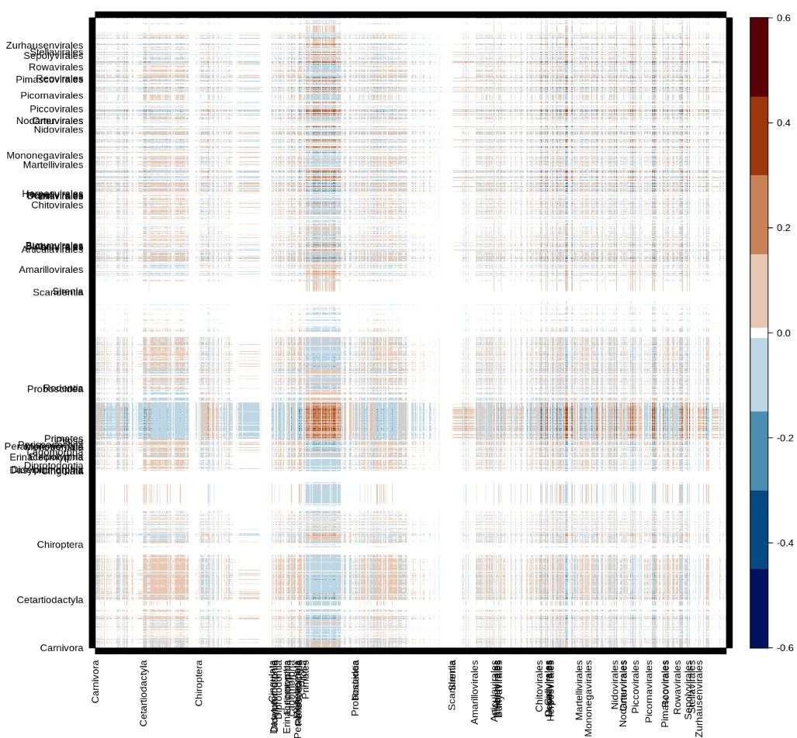

## Introduction

1.  Global health needs more ecology in viral forecasting

    Predicting viral spillover for future pandemic prevention + importance of ecology in the context of global health [@Belay2017Zoonotic; @Carroll2018Global] [@Plowright2017Pathways]. Works have been done to predict viral hotspot according to climate change [@Carlson2022Climate], future host distribution [@Morales-Castilla2021Forecasting] and potential viral sharing among host [@Albery2020Predicting]. Bring information on potential spillover path.

2.  Communicability already used in other field and context to estimate spread.

## Methods

Communicability quantify how well information transit between two nodes by considering all possible path in a network and penalizing longer ones. It is compute with the exponent of the adjacency matrix of the network. $$G=\sum_{k=0}^{\infty} \frac{\left(\mathbf{A}^k\right)}{k !}=e^{\mathbf{A}}$$

where $G$ is the communicability matrix, $A$ the adjacency matrix and k is used as a penalizing term. It is possible to compute the exponential of a matrix with the graph spectrum :

$$
G=\sum^n_{j=1}\varphi_j\varphi_j^T e^{\lambda_j}
$$

where $\varphi_j$ and $\lambda_j$ are respectively the $j^{th}$ eigenvectors and eigenvalues of the matrix $A$. Obtain cluster with Communicability is done only by removing the fist dimension in the computation of the previous equation.

$$
\Delta G=\sum^n_{j=1}\varphi_j\varphi_j^T e^{\lambda_j} -\varphi_1\varphi_1^{T} e^{\lambda_1}
$$

In this equation we are removing to global sum the dot production of the first eigenvector(and eigenvalue) to find the clustering matrix $\Delta G$. Let's keep in mind this final result and explain why this work for clustering.

We start with the spectral form of $G$ that can be decompose by the following way :

$$
G=\varphi_1\varphi_1^{T} e^{\lambda_1}+ 
\sum^n_{j=2}\varphi_j^{+}\varphi_j^{+T} e^{\lambda_j}+ 
\sum^n_{j=2}\varphi_j^{-}\varphi_j^{-T} e^{\lambda_j}+
\sum^n_{j=2}\varphi_j^{-}\varphi_j^{+T} e^{\lambda_j}
$${#eq:cluster1}

\

where $\varphi_j^+$ or $\varphi_j^-$ indicate respectively all the positives or negatives values of the $j^{th}$ eigenvector. A way to think about it would be that when $\varphi_j^+$ all negative values are set to 0 and when when $\varphi_j^-$ all positive values are set to 0. @Estrada2008Communicability explain that "two nodes have the same sign in an eigenvector if they can be considered as being in the same partition of the network, while those pairs having different signs correspond to nodes in different partitions.". $$\sum^{intracluster}_{j=2}\varphi_j\varphi_j^{T} e^{\lambda_j} = \sum^n_{j=2}\varphi_j^{+}\varphi_j^{+T} e^{\lambda_j}+ \sum^n_{j=2}\varphi_j^{-}\varphi_j^{-T} e^{\lambda_j}$$

and

$$\sum^{intercluster}_{j=2}\varphi_j\varphi_j^{T} e^{\lambda_j} = \sum^n_{j=2}\varphi_j^{-}\varphi_j^{+T} e^{\lambda_j}$$

so the clustering matrix is obtain with

$$\Delta G = \sum^{intracluster}_{j=2}\varphi_j\varphi_j^{T} e^{\lambda_j} -
\left|\sum^{intercluster}_{j=2}\varphi_j\varphi_j^{T} e^{\lambda_j}\right|$$

The absolute operator is not useful, it is just here to remind that all inter cluster values are negatives. The dot product of $\varphi_j\varphi_j^{T}$ produce a matrix with positive and negative sign depending on the sign of $\varphi_j(p)$ and $\varphi_j(q)$. The first is not include because all the values the eigenvector the same sign, so it is not really informative (In fact it consider the hole network as one cluster thus it does not bring interesting information on the clustering).

In short we can rewrite $\Delta G$ as follow :

$$\Delta G = 
G - \varphi_{1} \varphi_{1}^T e^{\lambda_1}$$

which was the form in which we introduce it.

##### Remark 1

Each dimension of the spectra form the 2nd to the last one is a clustering configuration of the network. Cluster identified by dim 3 are not necessarily independent form those in dim 2 or 4 (or all others). Although the cluster form by dim 2 are "stronger" then 3, 4, 5 ... and so on till the last one. So the dim 2 is the one that contribute the most for $\Delta G$ (we can see it in the following example).

##### Remark 2

In a graph nodes can be consider as diffuser or receiver. The communicability matrix can be use to quantify the capacity of nodes to communicate when they act like a diffuser a receiver. For example host-host or virus-virus parts of $G$ give information on the capacity of respectively host or virus to communicate when they are playing the same role in he network. see @Benzi2020Matrix for better explaination

#### Example

```{r}
library(tidyverse)
library(lattice)
library(igraph)
library(colorRamps)
A  = matrix(c(0,1,0,1,1,0,0,0,0,0,0,
              1,0,1,1,1,0,0,0,0,0,0,
              0,1,0,1,1,0,0,0,0,0,0,
              1,1,1,0,1,0,0,0,0,0,0,
              1,1,1,1,0,1,0,0,0,0,0,
              0,0,0,0,1,0,1,0,0,0,0,
              0,0,0,0,0,1,0,1,1,0,1,
              0,0,0,0,0,0,1,0,1,1,1,
              0,0,0,0,0,0,1,1,0,1,1,
              0,0,0,0,0,0,0,1,1,0,1,
              0,0,0,0,0,0,1,1,1,1,0), nrow =11, ncol =11)
grap = graph_from_adjacency_matrix(A, mode = "undirected")
plot(grap)
```

A graph with 11 nodes and 2 distinct group. First we need to compute the graph spectrum

```{r}
spectra = eigen(A)
levelplot(spectra$vectors, ylab ="j th position" , xlab ="eigenvectors")
```

The above plot just represent the 11 eigenvectors. We can see that the fisrt one is the only full of same sign value.

Now let's take the $2^{nd}$ dimension as an example.

```{r}
##
G_dim2 = spectra$vectors[,2]%*%t(spectra$vectors[,2])*exp(spectra$values[2])
levelplot(G_dim2, ylab = "node", xlab ="node",col.regions = rev(matlab.like(16)))
```

And that it ! The second dimension of the graph communicability identify 2 cluster (in blue).

We can compute for the third dimension

```{r}
G_dim3 = spectra$vectors[,3]%*%t(spectra$vectors[,3])*exp(spectra$values[3])
levelplot(G_dim3, ylab = "node", xlab ="node",col.regions = rev(matlab.like(16)))
```

Which identify clusters between 5:6 and 6:7. The cluster of the third dimension are less "obvious" than those from the second dimension

Now if we want to use both dimension in the clustering, we just have to add

```{r}
levelplot(G_dim2+G_dim3, ylab = "node", xlab ="node",col.regions = rev(matlab.like(16)))
```

We could continue like that till the last dimension (11th), but it was for the explanation. So now we can compute directly $\Delta G$ by adding dimension from 2 to 11 (or subtraction of the first dim which is exactly the same)

```{r}
delta_G = matrix(0, nrow =11, ncol =11)
for(dim in 2:11){
  delta_G = delta_G + spectra$vectors[,dim]%*%t(spectra$vectors[,dim])*exp(spectra$values[dim])
}
levelplot(delta_G, ylab = "node", xlab ="node",col.regions = rev(matlab.like(16)))
```

## Results

{#fig:global}

{#fig:host}

{#fig:host_recap}

{#fig:virus}

{#fig:virus_recap}

{#fig:host_virus}

{#fig:host_virus_recap}

{#fig:host_virus__rand_cluster}

{#fig:sharing_vs_clustering}


## Conclusion
